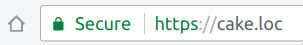
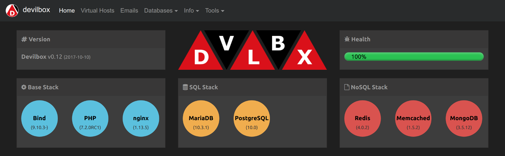

# Devilbox

**[Quickstart](https://github.com/cytopia/devilbox/blob/master/docs/Quickstart.md)**｜**[Install](https://github.com/cytopia/devilbox/blob/master/docs/Install.md)**｜**[Update](https://github.com/cytopia/devilbox/blob/master/docs/Update.md)**｜**[Configure](https://github.com/cytopia/devilbox/blob/master/docs/Configure.md)**｜**[Run](https://github.com/cytopia/devilbox/blob/master/docs/Run.md)**｜**[Usage](https://github.com/cytopia/devilbox/blob/master/docs/Usage.md)**｜**[OS](https://github.com/cytopia/devilbox/blob/master/docs/OS.md)**｜**[Backups](https://github.com/cytopia/devilbox/blob/master/docs/Backups.md)**｜**[Examples](https://github.com/cytopia/devilbox/blob/master/docs/Examples.md)**｜**[Technical](https://github.com/cytopia/devilbox/blob/master/docs/Technical.md)**｜**[Hacking](https://github.com/cytopia/devilbox/blob/master/docs/Hacking.md)**｜**[FAQ](https://github.com/cytopia/devilbox/blob/master/docs/FAQ.md)**

 <div class="center"><strong>Reproducable</strong> and identical development environment for <strong>all host operating</strong> systems with <strong>zero configuration</strong> requirements.</div>

---


### Docker LAMP development stack with valid https support

<div class="center">
  
</div>

<p class="center">
The Devilbox is a modern and highly customisable <strong>dockerized PHP stack</strong> supporting full <strong>LAMP</strong> and <strong>MEAN</strong> and running on all major platforms. The main goal is to easily switch and combine any version required for local development. <br/><br/>It supports an <strong>unlimited number of projects</strong> for which <strong>vhosts</strong>, <strong>SSL certificates</strong> and <strong>DNS records</strong> are created automatically. Email catch-all and popular development tools will be at your service as well. Configuration is not necessary, as everything is already pre-setup.</p>





### Supported Host OS

<p class="center">Don't worry about switching computers. The devilbox will run on all major operating systems.</p>

<div class="center">
  
  
  
</div>


### Install, Configure and Start

<p class="center">
  <strong>Documentation:</strong>
  <a href="https://devilbox.readthedocs.io/en/latest/getting-started/install-the-devilbox.html">Install the Devilbox</a> |
  <a href="https://devilbox.readthedocs.io/en/latest/getting-started/start-the-devilbox.html">Start the Devilbox</a> |
  <a href="https://devilbox.readthedocs.io/en/latest/configuration-files/env-file.html">.env file</a>
</p>

<p class="center">Your whole development stack is up and running in a few simple steps.</p>

<table width="100%" style="width:100%; display:table;">
 <thead>
  <tr>
   <th width="50%" style="width:50%;">Linux and MacOS</th>
   <th width="50%" style="width:50%;">Windows</th>
  </tr>
 </thead>
 <tbody style="vertical-align: bottom;">
  <tr>
   <td><pre># Get the Devilbox
$ git clone https://github.com/cytopia/devilbox</pre></td>
   <td>1. Clone <code>https://github.com/cytopia/devilbox</code> to <code>C:\devilbox</code> with <a href="https://git-scm.com/downloads">Git for Windows</a></td>
  </tr>
  <tr>
   <td><pre># Create docker-compose environment file
$ cd devilbox
$ cp env-example .env</pre></td>
   <td>2. Copy <code>C:\devilbox\env-example</code> to <code>C:\devilbox\.env</code></td>
  </tr>
  <tr>
   <td><pre># Edit your configuration
$ vim .env</pre></td>
   <td>3. Edit <code>C:\devilbox\.env</code></td>
  </tr>
  <tr>
   <td><pre># Start all container
$ docker-compose up</pre></td>
   <td><pre># Start all container
C:\devilbox> docker-compose up</pre></td>
  </tr>
 </tbody>
</table>


### Run exactly what you need

<p class="center">
  <strong>Documentation:</strong>
  <a href="https://devilbox.readthedocs.io/en/latest/getting-started/change-container-versions.html">Change container versions</a>
</p>

<p class="center">Choose your required daemons and select a version. Any combination is possible.<br/>This will allow you, to always exactly simulate your production environment locally during development.</p>
<table>
  <thead>
    <tr>
      <th>Apache</th>
      <th>Nginx</th>
      <th>PHP</th>
      <th>MySQL</th>
      <th>MariaDB</th>
      <th>PerconaDB</th>
      <th>PgSQL</th>
      <th>Redis</th>
      <th>Memcached</th>
      <th>MongoDB</th>
    </tr>
  </thead>
  <tbody>
    <tr>
      <td><a target="_blank" title="Apache 2.2"       href="https://github.com/devilbox/docker-apache-2.2">2.2</a></td>
      <td><a target="_blank" title="Nginx stable"     href="https://github.com/devilbox/docker-nginx-stable">stable</a></td>
      <td><a target="_blank" title="PHP 5.2"          href="https://github.com/devilbox/docker-php-fpm">5.2</a><sup>[1]</sup></td>
      <td><a target="_blank" title="MySQL 5.5"        href="https://github.com/cytopia/docker-mysql-5.5">5.5</a></td>
      <td><a target="_blank" title="MariaDB 5.5"      href="https://github.com/cytopia/docker-mariadb-5.5">5.5</a></td>
      <td><a target="_blank" title="PerconaDB 5.5"    href="https://github.com/cytopia/docker-percona-5.5">5.5</a></td>
      <td><a target="_blank" title="PgSQL 9.1"        href="https://github.com/docker-library/postgres">9.1</a></td>
      <td><a target="_blank" title="Redis 2.8"        href="https://github.com/docker-library/redis">2.8</a></td>
      <td><a target="_blank" title="Memcached 1.4.21" href="https://github.com/docker-library/memcached">1.4.21</a></td>
      <td><a target="_blank" title="MongoDB 2.8"      href="https://github.com/docker-library/mongo">2.8</a></td>
    </tr>
    <tr>
      <td><a target="_blank" title="Apache 2.4"       href="https://github.com/devilbox/docker-apache-2.4">2.4</a></td>
      <td><a target="_blank" title="Nginx mainline"   href="https://github.com/devilbox/docker-nginx-mainline">mainline</a></td>
      <td><a target="_blank" title="PHP 5.3"          href="https://github.com/devilbox/docker-php-fpm">5.3</a></td>
      <td><a target="_blank" title="MySQL 5.6"        href="https://github.com/cytopia/docker-mysql-5.6">5.6</a></td>
      <td><a target="_blank" title="MariaDB 10.0"     href="https://github.com/cytopia/docker-mariadb-10.0">10.0</a></td>
      <td><a target="_blank" title="PerconaDB 5.6"    href="https://github.com/cytopia/docker-percona-5.6">5.6</a></td>
      <td><a target="_blank" title="PgSQL 9.2"        href="https://github.com/docker-library/postgres">9.2</a></td>
      <td><a target="_blank" title="Redis 3.0"        href="https://github.com/docker-library/redis">3.0</a></td>
      <td><a target="_blank" title="Memcached 1.4.22" href="https://github.com/docker-library/memcached">1.4.22</a></td>
      <td><a target="_blank" title="MongoDB 3.0"      href="https://github.com/docker-library/mongo">3.0</a></td>
    </tr>
    <tr>
      <td></td>
      <td></td>
      <td><a target="_blank" title="PHP 5.4"          href="https://github.com/devilbox/docker-php-fpm">5.4</a></td>
      <td><a target="_blank" title="MySQL 5.7"        href="https://github.com/cytopia/docker-mysql-5.7">5.7</a></td>
      <td><a target="_blank" title="MariaDB 10.1"     href="https://github.com/cytopia/docker-mariadb-10.1">10.1</a></td>
      <td><a target="_blank" title="PerconaDB 5.7"    href="https://github.com/cytopia/docker-percona-5.7">5.7</a></td>
      <td><a target="_blank" title="PgSQL 9.3"        href="https://github.com/docker-library/postgres">9.3</a></td>
      <td><a target="_blank" title="Redis 3.2"        href="https://github.com/docker-library/redis">3.2</a></td>
      <td><a target="_blank" title="Memcached 1.4.23" href="https://github.com/docker-library/memcached">1.4.23</a></td>
      <td><a target="_blank" title="MongoDB 3.2"      href="https://github.com/docker-library/mongo">3.2</a></td>
    </tr>
    <tr>
      <td></td>
      <td></td>
      <td><a target="_blank" title="PHP 5.5"          href="https://github.com/devilbox/docker-php-fpm">5.5</a></td>
      <td><a target="_blank" title="MySQL 8.0"        href="https://github.com/cytopia/docker-mysql-8.0">8.0</a></td>
      <td><a target="_blank" title="MariaDB 10.2"     href="https://github.com/cytopia/docker-mariadb-10.2">10.2</a></td>
      <td></td>
      <td><a target="_blank" title="PgSQL 9.4"        href="https://github.com/docker-library/postgres">9.4</a></td>
      <td><a target="_blank" title="Redis 4.0"        href="https://github.com/docker-library/redis">4.0</a></td>
      <td><a target="_blank" title="Memcached 1.4.23" href="https://github.com/docker-library/memcached">1.4.24</a></td>
      <td><a target="_blank" title="MongoDB 3.4"      href="https://github.com/docker-library/mongo">3.4</a></td>
    </tr>
    <tr>
      <td></td>
      <td></td>
      <td><a target="_blank" title="PHP 5.6"          href="https://github.com/devilbox/docker-php-fpm">5.6</a></td>
      <td></td>
      <td><a target="_blank" title="MariaDB 10.3"     href="https://github.com/cytopia/docker-mariadb-10.3">10.3</a></td>
      <td></td>
      <td><a target="_blank" title="PgSQL 9.5"        href="https://github.com/docker-library/postgres">9.5</a></td>
      <td></td>
      <td>...</td>
      <td><a target="_blank" title="MongoDB 3.5"      href="https://github.com/docker-library/mongo">3.5</a></td>
    </tr>
    <tr>
      <td></td>
      <td></td>
      <td><a target="_blank" title="PHP 7.0"          href="https://github.com/devilbox/docker-php-fpm">7.0</a></td>
      <td></td>
      <td></td>
      <td></td>
      <td><a target="_blank" title="PgSQL 9.6"        href="https://github.com/docker-library/postgres">9.6</a></td>
      <td></td>
      <td><a target="_blank" title="Memcached 1.5.2"  href="https://github.com/docker-library/memcached">1.5.2</a></td>
      <td></td>
    </tr>
    <tr>
      <td></td>
      <td></td>
      <td><a target="_blank" title="PHP 7.1"          href="https://github.com/devilbox/docker-php-fpm">7.1</a></td>
      <td></td>
      <td></td>
      <td></td>
      <td><a target="_blank" title="PgSQL 10.0"       href="https://github.com/docker-library/postgres">10.0</a></td>
      <td></td>
      <td><a target="_blank" title="Memcached latest" href="https://github.com/docker-library/memcached">latest</a></td>
      <td></td>
    </tr>
    <tr>
      <td></td>
      <td></td>
      <td><a target="_blank" title="PHP 7.2"          href="https://github.com/devilbox/docker-php-fpm">7.2</a></td>
      <td></td>
      <td></td>
      <td></td>
      <td></td>
      <td></td>
      <td></td>
      <td></td>
    </tr>
    <tr>
      <td></td>
      <td></td>
      <td><a target="_blank" title="PHP 7.3"          href="https://github.com/devilbox/docker-php-fpm">7.3</a></td>
      <td></td>
      <td></td>
      <td></td>
      <td></td>
      <td></td>
      <td></td>
      <td></td>
    </tr>
  </tbody>
</table>

<p class="center"> <strong><sup>[1]</sup></strong> <strong>PHP 5.2</strong> is available to use, but it is not officially supported. The Devilbox intranet does not work with this version as PHP 5.2 does not support namespaces.
Furthermore PHP 5.2 does only work with Apache 2.4, Nginx stable and Nginx mainline. It does not work with Apache 2.2. Use at your own risk.</p>


### Additional services

<p class="center">
  <strong>Documentation:</strong>
  <a href="https://devilbox.readthedocs.io/en/latest/custom-container/enable-all-container.html">Enable custom container</a>
</p>

<p class="center">Additionally to the default stack, there are a variety of other services that can be easily enabled and started.</p>

<table>
 <thead>
  <tr>
   <th>MailHog</th>
   <th>RabbitMQ</th>
  </tr>
 </thead>
 <tbody>
  <tr>
   <td>v1.0.0</td>
   <td>3.6</td>
  </tr>
  <tr>
   <td>latest</td>
   <td>3.7</td>
  </tr>
  <tr>
   <td></td>
   <td>latest</td>
  </tr>
 </tbody>
</table>


### Run only what you need

<p class="center">
  <strong>Documentation:</strong>
  <a href="https://devilbox.readthedocs.io/en/latest/getting-started/start-the-devilbox.html#start-some-container">Start only some container</a>
</p>

<p class="center">You are not forced to load the whole stack everytime. Only bring up what you really need.<br/>It is also possible to add or remove daemons while the stack is already running.</p>

```shell
# Load traditional lamp stack only
$ docker-compose up httpd php mysql

# Add redis to the running stack
$ docker-compose up redis

# Stop MySQL from the current stack
$ docker-compose stop mysql
```

### Introduction Videos

<p class="center">Head over to youtube for a quick introduction and see for yourself how easily new projects can be created.</p>

<div class="center">
  <a target="_blank" href="https://www.youtube.com/watch?v=reyZMyt2Zzo" alt="Devilbox introduction video" title="Devilbox introduction video"></a>
  <a target="_blank" href="https://www.youtube.com/watch?v=e-U-C5WhxGY" alt="Devilbox Email catch-all introduction" title="Devilbox Email catch-all introduction"></a>
</div>


### PHP Modules

<div class="center">
  <p>The devilbox is a development stack, so it is made sure that a lot of PHP modules are available out of the box in order to work with many different frameworks. There will however be slight differences between the versions and especially with HHVM. To see the exact bundled modules for each version visit the corresponding docker repositories on Github:</p>

  

  <p>
  <strong><a title="PHP 5.2" href="https://github.com/devilbox/docker-php-fpm">PHP 5.2</a></strong> |
  <strong><a title="PHP 5.3" href="https://github.com/devilbox/docker-php-fpm">PHP 5.3</a></strong> |
  <strong><a title="PHP 5.4" href="https://github.com/devilbox/docker-php-fpm">PHP 5.4</a></strong> |
  <strong><a title="PHP 5.5" href="https://github.com/devilbox/docker-php-fpm">PHP 5.5</a></strong> |
  <strong><a title="PHP 5.6" href="https://github.com/devilbox/docker-php-fpm">PHP 5.6</a></strong> |
  <strong><a title="PHP 7.0" href="https://github.com/devilbox/docker-php-fpm">PHP 7.0</a></strong> |
  <strong><a title="PHP 7.1" href="https://github.com/devilbox/docker-php-fpm">PHP 7.1</a></strong> |
  <strong><a title="PHP 7.2" href="https://github.com/devilbox/docker-php-fpm">PHP 7.2</a></strong> |
  <strong><a title="PHP 7.3" href="https://github.com/devilbox/docker-php-fpm">PHP 7.3</a></strong>
  </p>
<p>amqp, apcu, bcmath, bz2, calendar, Core, ctype, curl, date, dba, dom, enchant, exif, fileinfo, filter, ftp, gd, gettext, gmp, hash, iconv, igbinary, imagick, imap, interbase, intl, json, ldap, libxml, mbstring, mcrypt, memcache, memcached, mongodb, msgpack, mysqli, mysqlnd, openssl, pcntl, pcre, PDO, pdo_dblib, PDO_Firebird, pdo_mysql, pdo_pgsql, pdo_sqlite, pgsql, phalcon, Phar, posix, pspell, readline, recode, redis, Reflection, session, shmop, SimpleXML, snmp, soap, sockets, sodium, SPL, sqlite3, standard, swoole, sysvmsg, sysvsem, sysvshm, tidy, tokenizer, uploadprogress, wddx, xdebug, xml, xmlreader, xmlrpc, xmlwriter, xsl, Zend OPcache, zip, zlib</p>
</div>


### Email catch-all

<div class="center">
  
  <p>The built-in postfix mailserver is configured to automatically intercept all outgoing emails. This is an important measurement during development to make sure not to accidentally send out real emails. Instead you will be able to see all sent emails in the included intranet mail view. See Intranet section below.</p>
</div>


### Auto-DNS

<div class="center">
  
  <p>Creating a new project just requires you to create a new folder on the filesystem. As you probalby don't want to bother with editing your /etc/hosts file everytime, the built-in DNS server will automatically provide the correct DNS records for every project.</p>
</div>


### Batteries included

<div class="center">
  <strong>Documentation:</strong> <a href="https://devilbox.readthedocs.io/en/latest/readings/available-tools.html">Available Tools</a>
</div>

<p class="center">No need to download external tools. Everything is bundled, up-to-date and available inside the containers.</p>

<table width="100%" style="width:100%; display:table;">
<tbody style="text-align:center;">
 <tr>
  <td><a href="https://www.adminer.org"></a></td>
  <td><a href="https://www.phpmyadmin.net"></a></td>
  <td><a href="https://github.com/sasanrose/phpredmin"></a></td>
  <td><a href="https://github.com/PeeHaa/OpCacheGUI"></a></td>
  <td></td>
 </tr>
 <tr>
  <td><a href="https://www.adminer.org">Adminer</a></td>
  <td><a href="https://www.phpmyadmin.net">phpMyAdmin</a></td>
  <td><a href="https://github.com/sasanrose/phpredmin">phpRedMin</a></td>
  <td><a href="https://github.com/PeeHaa/OpCacheGUI">OpCache GUI</a></td>
  <td>Mail viewer</td>
 </tr>
</tbody>
</table>

<div class="center">
  <a target="_blank" title="Ansible" href="https://www.ansible.com/"></a>
  <a target="_blank" title="CodeCeption" href="https://codeception.com/"></a>
  <a target="_blank" title="Composer" href="https://getcomposer.org"></a>
  <a target="_blank" title="Drupal Console" href="https://drupalconsole.com"></a>
  <a target="_blank" title="Drush" href="https://www.drupal.org/project/drush"></a>
  <a target="_blank" title="ESLint" href="https://eslint.org/"></a>
  <a target="_blank" title="Git" href="https://git-scm.com"></a>
  <a target="_blank" title="Gulp" href="https://gulpjs.com/"></a>
  <a target="_blank" title="Grunt" href="https://gruntjs.com/"></a>
  <a target="_blank" title="mysqldump-secure" href="https://mysqldump-secure.org"></a>
  <a target="_blank" title="NodeJS" href="https://nodejs.org"></a>
  <a target="_blank" title="NPM" href="https://www.npmjs.com"></a>
  <a target="_blank" title="PHPUnit" href="https://phpunit.de/"></a>
  <a target="_blank" title="Sass" href="https://sass-lang.com/"></a>
  <a target="_blank" title="Webpack" href="https://webpack.js.org/"></a>
  <a target="_blank" title="Yarn" href="https://yarnpkg.com/en/"></a>
</div>


### Supported Frameworks and CMS

<p class="center">There is nothing special about the devilbox, so any framework or CMS that will work with normal LAMP/MEAN stacks will work here as well. However in order to make double sure, a few popular applications have been explicitly tested.</p>

<div class="center">
  <a target="_blank" title="CakePHP" href="https://cakephp.org"></a>
  <a target="_blank" title="CodeIgniter" href="https://www.codeigniter.com"></a>
  <a target="_blank" title="CraftCMS" href="https://craftcms.com/"></a>
  <a target="_blank" title="Drupal" href="https://www.drupal.org"></a>
  <a target="_blank" title="Joomla" href="https://www.joomla.org"></a>
  <a target="_blank" title="Laravel" href="https://laravel.com"></a>
  <a target="_blank" title="Magento" href="https://magento.com"></a>
  <a target="_blank" title="PhalconPHP" href="https://phalconphp.com"></a>
  <a target="_blank" title="PhotonCMS" href="https://photoncms.com"></a>
  <a target="_blank" title="PrestaShop" href="https://www.prestashop.com/en"></a>
  <a target="_blank" title="Shopware" href="https://en.shopware.com"></a>
  <a target="_blank" title="Symfony" href="https://symfony.com"></a>
  <a target="_blank" title="Typo3" href="https://typo3.org"></a>
  <a target="_blank" title="Wordpress" href="https://wordpress.org"></a>
  <a target="_blank" title="Yii" href="http://www.yiiframework.com"></a>
  <a target="_blank" title="Zend" href="https://framework.zend.com"></a>
</div>

> **Documentation:**<br/>
> [Setup CakePHP](https://devilbox.readthedocs.io/en/latest/examples/setup-cakephp.html) |
> [Setup CodeIgniter](https://devilbox.readthedocs.io/en/latest/examples/setup-codeigniter.html) |
> [Setup CraftCMS](https://devilbox.readthedocs.io/en/latest/examples/setup-craftcms.html) |
> [Setup Drupal](https://devilbox.readthedocs.io/en/latest/examples/setup-drupal.html) |
> [Setup Joomla](https://devilbox.readthedocs.io/en/latest/examples/setup-joomla.html) |
> [Setup Laravel](https://devilbox.readthedocs.io/en/latest/examples/setup-laravel.html) |
> [Setup Magento](https://devilbox.readthedocs.io/en/latest/examples/setup-magento.html) |
> [Setup PhalconPHP](https://devilbox.readthedocs.io/en/latest/examples/setup-phalcon.html) |
> [Setup PhotonCMS](https://devilbox.readthedocs.io/en/latest/examples/setup-photon-cms.html) |
> [Setup PrestaShop](https://devilbox.readthedocs.io/en/latest/examples/setup-presta-shop.html) |
> [Setup Shopware](https://devilbox.readthedocs.io/en/latest/examples/setup-shopware.html) |
> [Setup Symfony](https://devilbox.readthedocs.io/en/latest/examples/setup-symfony.html) |
> [Setup Typo3](https://devilbox.readthedocs.io/en/latest/examples/setup-typo3.html) |
> [Setup Wordpress](https://devilbox.readthedocs.io/en/latest/examples/setup-wordpress.html) |
> [Setup Yii](https://devilbox.readthedocs.io/en/latest/examples/setup-yii.html) |
> [Setup Zend](https://devilbox.readthedocs.io/en/latest/examples/setup-zend.html)


### Community

<p class="center">Find documentation and help here.</p>

<table width="100%" style="width:100%; display:table;">
 <thead>
  <tr>
   <th width="33%" style="width:33%;"><a href="https://devilbox.readthedocs.io" >Documentation</a></th>
   <th width="33%" style="width:33%;"><a href="https://gitter.im/devilbox/Lobby" >Chat</a></th>
   <th width="33%" style="width:33%;"><a href="https://devilbox.discourse.group/">Forum</a></th>
  </tr>
 </thead>
 <tbody style="vertical-align: middle; text-align: center;">
  <tr>
   <td>
    <a href="https://devilbox.readthedocs.io">
	 
    </a>
   </td>
   <td>
    <a href="https://gitter.im/devilbox/Lobby">
     
    </a>
   </td>
   <td>
    <a href="https://devilbox.discourse.group/">
     
    </a>
   </td>
  </tr>
  <tr>
  <td><a href="https://devilbox.readthedocs.io">devilbox.readthedocs.io</a></td>
  <td><a href="https://gitter.im/devilbox/Lobby">gitter.im/devilbox</a></td>
  <td><a href="https://devilbox.discourse.group/">devilbox.discourse.group</a></td>
  </tr>
 </tbody>
</table>


### Devilbox Intranet

<p class="center">Once the devilbox is up and running, you can visit the bundled intranet on <a target="_blank" href="http://localhost">http://localhost</a>.<br/>The intranet is not just a simple dash, it provides many useful tools:</p>

<div class="center">
  Container Health | DNS Status | Available vHosts | Emails | Databases | Effective Configuration<br/>
  
  
  
</div>


### Security

<p class="center">Be aware that the docker service is running with root privileges on your system (like any other webserver for example). The devilbox is using a mix of official docker images and custom images. All integrated containers are available on <a href="https://github.com/cytopia/devilbox#run-time-matrix">Github</a> and can be reviewed at any time.</p>


### Up-to-dateness

<p class="center">Docker containers are pushed to <a target="_blank" href="https://hub.docker.com/r/devilbox">Docker Hub</a> frequently.<br/>It should be enough for you to pull updated images on a regeular basis.</p>

```shell
$ docker-compose pull
```

<p class="center">However, if a new minor version (PHP for example) has just been released and you want to use it right away, you can simply *git clone* the docker repository and rebuild the container. Each container repository contains a shell script for easy building.</p>

```shell
# Download PHP 7.1 repository
$ git clone https://github.com/cytopia/docker-php-fpm-7.1

# Rebuild the container in order to get the latest minor/patch version
$ cd docker-php-fpm-7.1
$ ./build/docker-rebuild.sh
```


### Integration Tests

<p class="center">In order to make sure everything always runs stable and as expected, the devilbox makes heavy use of integration tests. You can head over to <a target="_blank" href="https://travis-ci.org/cytopia/devilbox">Travis-CI</a> and have a look at stable and nightly builds.</p>


### Contribute

<div class="center">
  <p>Contributers are welcome in any way.</p>
  
  <p>First of all, if you like the project, please <a href="https://github.com/cytopia/devilbox">do star it</a>. Starring is an important measurement to see the number of active users and better allows me to organize my time and effort I can put into this project.</p>
  
  <p>You can also get actively involved. <a href="https://github.com/cytopia/devilbox">Do clone the project</a> and start improving whatever you think is useful. There is quite a lot todo and planned. If you like to contribute, view <a href="https://github.com/cytopia/devilbox/blob/master/CONTRIBUTING.md">CONTRIBUTING.md</a> and <a href="https://github.com/cytopia/devilbox/issues/23">ROADMAP</a>.</p>
  
  <p>Major contributors will be credited within the intranet and on the github page.</p>
</div>


### License

<div class="center">
  <p>MIT License</p>
  <p>Copyright (c) 2016-2018 cytopia</p>
</div>

